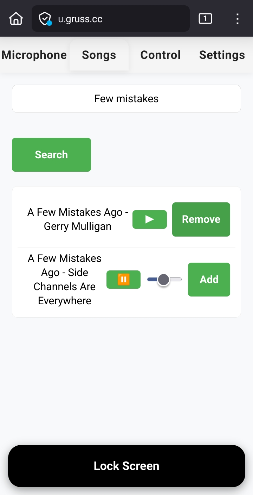
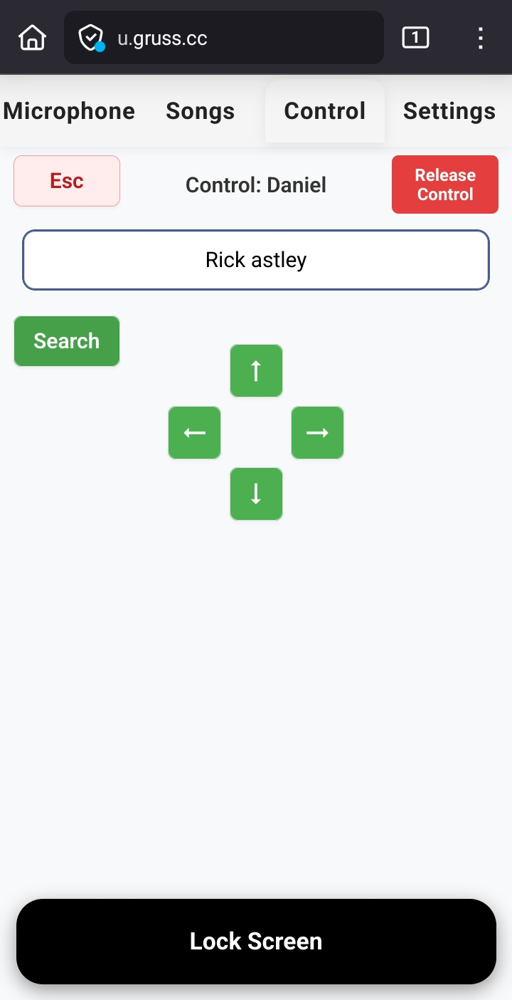
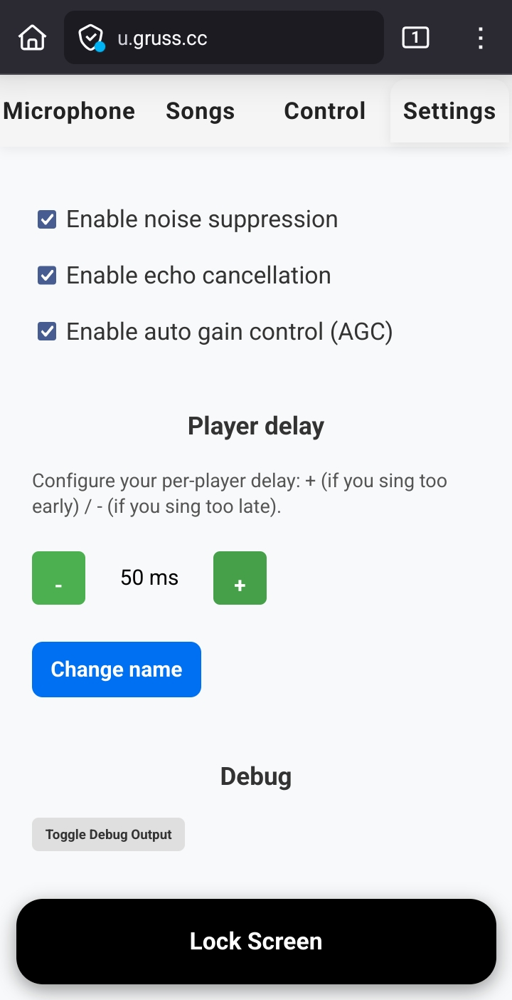

# SmartMicrophone

SmartMicrophone is a modern, open-source web-based microphone and remote control system for UltraStar Deluxe (USDX) and compatible karaoke games. It lets you use your smartphone as a wireless microphone, control the game from your phone, manage songs, and adjust settings---all through a fast, mobile-friendly web interface.

---

## Features
- **Wireless Microphone:** Use your phone as a microphone for UltraStar Deluxe.
- **Multi-mic Support:** Up to 6 virtual microphones, each mapped to a player slot.
- **Remote Control:** Send keystrokes and text to the game, including navigation and search.
- **Song Management:** Search, preview, and add songs to playlists.
- **Playlist Automation & Countdown Overlays:** Auto-advance UltraStar playlists with configurable countdowns and an optional transparent stage overlay.
- **Settings Panel:** Configure audio options, delays, and more --- instantly, and per device
- **Control & Room Safeguards:** Control-only deployments, optional passwords, capacity limits, and live mic health monitoring keep large events organized.
- **Hotspot & Network Integration:** Supports Wi-Fi hotspot mode and advanced network forwarding.
- **Automatic Device Mapping:** Maps domain names to hotspot IPs for easy connection.
- **Secure HTTPS Option:** SSL support and port remapping for secure connections.

---

## Installation
git clone https://github.com/dgruss/SmartMicrophone.git
### Supported OS: Ubuntu/Debian (recommended)

#### 1. Install System Dependencies
```sh
sudo add-apt-repository ppa:longsleep/golang-backports
sudo apt update
sudo apt install python3 python3-pip python3-tk python3-pyqt5 git make gcc make pkg-config libopus-dev libopusfile-dev libpulse-dev golang-go libsdl2-image-dev python3-flask pipewire pipewire-pulse libpulse-dev libopus-dev
```

#### 2. Clone the Repository, Submodules, and build pulse-receive
```sh
git clone https://github.com/dgruss/SmartMicrophone.git
cd SmartMicrophone/pulse-receive
go build .
cd ..
```

#### 3. Prepare UltraStar Deluxe
- Install UltraStar Deluxe and place your songs in the appropriate folder (currently only the /songs folder is supported but symlinks are followed)
- Some features require using [the dgruss beta3](https://github.com/dgruss/USDX/tree/beta3) version as they are not upstreamed yet
- Make sure you know the path to your usdx game directory (e.g., `/home/user/usdx`)

```
cd ~
git clone https://github.com/dgruss/USDX.git usdxdev
cd usdxdev
git checkout beta3
sudo apt install git automake make gcc fpc libsdl2-image-dev libavformat-dev libavcodec-dev libavutil-dev libswresample-dev libswscale-dev libsqlite3-dev libfreetype6-dev portaudio19-dev libportmidi-dev liblua5.3-dev libopencv-videoio-dev fonts-dejavu
./autogen.sh
./configure --without-portaudio --without-portmixer
make
cd ~
ln -s ~/usdxdev/game usdx
```

#### 4. (Optional) Configure SSL, Set up Wi-Fi Hotspot and Internet Forwarding
- Place your SSL certificate and key files in the project directory if you want HTTPS --- this might be required to convince your phone to use WebRTC. Self-signed certificates work. Otherwise you can use a domain or subdomain you have on the Internet (give the DNS entry a short lifetime on your server!) and configure SmartMicrophone to use domain and certificates
- See Advanced Networking below for details

## Usage

### Basic Server Startup
```sh
python3 server.py
```

Do **not** run the server with `sudo`.

### Common Command-Line Arguments

Some options perform operations that require `sudo` permission. However, SmartMicrophone should not be run with `sudo`. Instead, SmartMicrophone will invoke `sudo` internally, which means you may be prompted for your `sudo` password.


#### Networking & Security
| Option | Description |
|--------|-------------|
| `--start-hotspot <name>` | Start the given hotspot using nmcli before domain setup |
| `--internet-device <iface>` | Network interface providing internet connectivity (e.g., wlan0), invokes sudo |
| `--hotspot-device <iface>` | Network interface for the hotspot (e.g., wlan1), invokes sudo |
| `--enable-forwarding` | Add iptables forwarding/MASQUERADE rules between internet/hotspot interfaces |
| `--ssl` | Enable SSL (requires --chain and --key) |
| `--chain <cert>` | SSL chain/cert file (fullchain.pem or cert.pem) |
| `--key <key>` | SSL private key file (privkey.pem) |
| `--port <port>` | Port to run the server on (default: 5000) |
| `--remap-ssl-port` | Remap ports so that users can access the server on the default HTTPS port, invokes sudo |
| `--domain <domain>` | Setup a domain to hotspot IP mapping via NetworkManager/dnsmasq, invokes sudo |

#### UltraStar Deluxe Integration
| Option | Description |
|--------|-------------|
| `--usdx-dir <path>` | Path to usdx directory (default: ../usdx) |
| `--playlist-name <name>` | Playlist filename (default: SmartMicSession.upl) |
| `--run-usdx` | Run UltraStar Deluxe after server startup |
| `--audio-format <ext>` | Audio format of songs in UltraStar Deluxe (default: m4a) |
| `--set-inputs` | Initialize [Record] section in config.ini for 6 virtual sinks |
| `--skip-scan-songs` | Skips the song scan to speed up the server start |
| `--usdx-log-file <path>` | Absolute path to the UltraStar `Error.log` used for playlist resync automation |
| `--countdown <sec>` | Default countdown seconds for every playlist phase (overridable from the UI) |

#### Server Options
| Option | Description |
|--------|-------------|
| `--debug` | Enable debug mode |
| `--control-only` | Disable microphone/WebRTC capture and use the web UI for control-only workflows |
| `--control-password <value>` | Require this password before a session can use the Control tab or playlist tools |
| `--max-name-length <n>` | Clamp player display names to `n` characters (default: 16) |

### Example: Full Setup with Hotspot and Forwarding
```sh
python3 server.py --ssl --chain ../cert.pem --key ../key.pem --remap-ssl-port --domain usdx.gruss.cc --set-inputs --start-hotspot usdx --internet-device wlan1 --hotspot-device wlan0 --run-usdx
```

### Playlist Automation & Countdown Overlay

SmartMicrophone now drives UltraStar Deluxe's playlist mode end-to-end: it can queue entries, confirm players/scores, and keep everyone in sync with visual countdowns.

**Prerequisites**

- A working UltraStar playlist (default `SmartMicSession.upl`) inside the `playlists/` folder of your USDX installation.
- Read access to the game's `Error.log`. The server auto-detects common locations, or you can point directly at it with `--usdx-log-file`.
- A desktop session with xdotool access (matching previous releases) plus Tk/PyQt packages for transparent overlays (`python3-tk` and `python3-pyqt5`).

**Workflow**

1. Acquire the Control tab (and enter the password if `--control-password` is set).
2. Use the new Playlist Mode card to toggle automation, choose countdown durations, and advance to the next song.
3. Adjust the default countdown globally via `--countdown` or per phase from the UI. The server monitors USDX logs for decoder events and automatically transitions through player selection, singing, scores, and highscores.

Whenever a countdown starts, `countdown_overlay.py` launches on the server to display a fullscreen transparent timer. Tkinter provides the default overlay; if Tk transparency is unavailable, SmartMicrophone falls back to PyQt5. You can run the overlay on the same host (requires an active `$DISPLAY`) or disable it by removing/renaming the script.

### Access Control, Room Capacity & Control-Only Mode

- Set `--control-password` to gate the Control tab, keystrokes, and playlist automation. Each browser session must authenticate once, and the server remembers the choice per session.
- The Control tab now exposes a "Channel capacity" slider. When you hold the control lock you can raise/lower the allowed singers per mic; the values persist in `data/room_capacity.json`, and the mobile UI prevents new joins once a channel is full.
- Use `--max-name-length` to keep display names concise on scoreboards.
- `--control-only` skips all WebRTC setup, microphone scanning, and PulseWire plumbing. This is ideal for a remote FOH operator who only needs the control & playlist dashboards while leaving audio capture to another machine.

---

## Web Interface Overview

Access the server from your phone or computer:
```
http://<server-ip>:<port>/
```
Or, if using SSL and port remapping:
```
https://<domain>/
```

### Tabs & Screenshots
| &nbsp;                                                                 | &nbsp;                                                                                                   |
|----------------------------------------------------------------------------|------------------------------------------------------------------------------------------------------------
|  |  |
| **Microphone** <br>- View occupancy, per-room capacity, and a live mic health meter<br>- Join/leave mic rooms and launch the lock screen video for your slot | **Songs** <br>- Search by artist or title<br>- Preview audio<br>- Add songs to playlist |
|  |  |
| **Control** <br>- Acquire/release control (optionally password-protected)<br>- Send keystrokes or synced text<br>- Adjust channel capacity<br>- Drive playlist automation and countdowns | **Settings** <br>- Noise suppression, echo cancellation, normalization<br>- Set per-player delay<br>- Change display name<br>- Enable debug output |
|  | **Lock Screen** <br>- Prevent accidental taps/swipes<br>- Standby mode during singing |

## Advanced Networking

### Hotspot & Domain Mapping
- Use `--start-hotspot` to activate a Wi-Fi hotspot
- Use `--domain` to map a domain name to the hotspot IP for easy phone connection

### Internet Forwarding
- Use `--internet-device` and `--hotspot-device` to forward internet from one interface to another (iptables rules, requires sudo)

### SSL & Port Remapping
- Use `--ssl`, `--chain`, and `--key` for HTTPS
- Use `--remap-ssl-port` to allow access via port 443 (requires sudo)

---

## Troubleshooting

### Common Issues

- **Network problems:**
  - Verify that the hotspot exists in network manager with the corresponding name (e.g. usdx).
  - flush all iptables rules `sudo iptables -F`
  - First connect the internet device, then create the hotspot, then run this tool.

---

## Contributing
Pull requests and issues are welcome!
